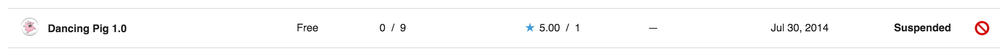
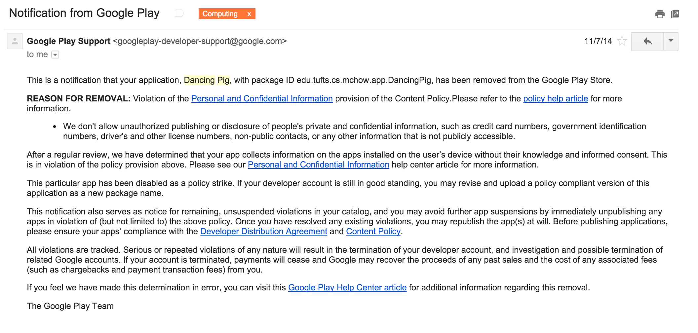

#Overview
_"Given a choice between dancing pigs and security, users will pick dancing pigs every time."_ -- Ed Felten and Gary McGraw

This is an Android app that steals all the names of apps installed on device and sends them to a web server.  I developed this app in summer 2014 to validate Ed and Gary's famous quote.

#Warning
This app was published on the Google Play store on July 30, 2014.

The app was suspended on November 7, 2014.  It took Google 99 days to catch my app.

